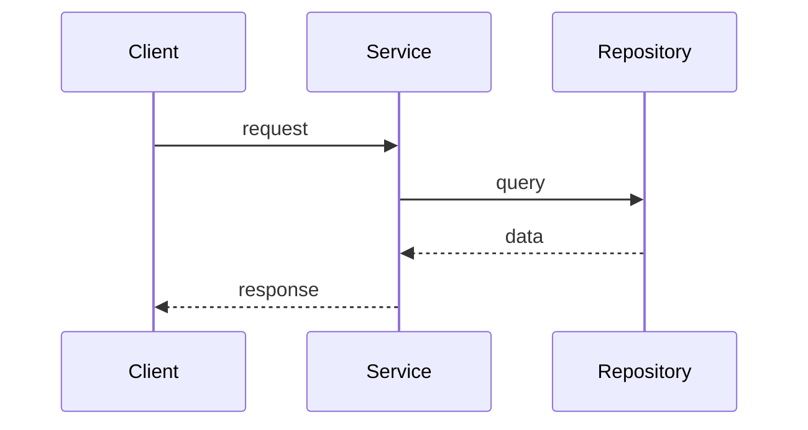
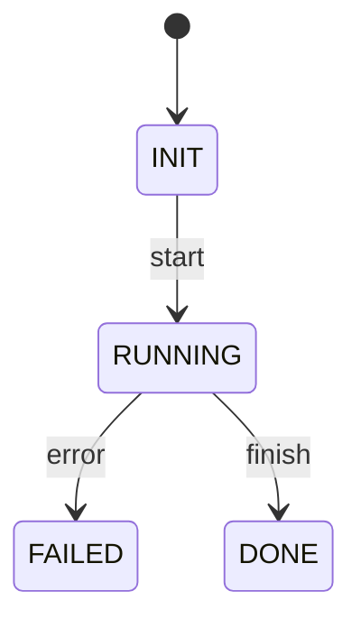

# 技术设计文档模板（通用）

按下面结构组织输出，章节可增删，但不得删除“来源清单”和“待确认项”。

## 1. 文档来源清单

| 路径          | 类型    | 采纳方式               | 说明     |
| ------------- | ------- | ---------------------- | -------- |
| `docs/xxx.md` | 文档/图 | 已采纳/背景参考/待确认 | 1 行说明 |

要求：
- 覆盖扫描到的全部文档与图。
- 对未采纳项写明原因（过期/重复/信息不足等）。

## 2. 背景与目标

- 当前问题与业务背景
- 本次设计目标
- 明确不在范围内的事项（Out of Scope）

## 3. 术语与边界

- 核心名词解释
- 系统边界、上下游、依赖关系
- 空间/租户/环境边界（如存在）

## 4. 核心场景流程（建议场景化）

场景可从：
- 用户与页面的交互进行推导，比如页面数据如何加载出来的、如何新增，更新，删除的等交互场景
- 系统启动时是否有初始化
- 领域内部的一些其他操作

每个场景建议固定模板：

### 场景 N：{场景名称}

- 触发条件：
- 输入：
- 关键步骤：
- 输出：
- 异常与回滚：
- 证据来源：

如原始资料有伪代码，优先保留并做最小改写：

```pseudo
ServiceA.handle(request):
    data = Repository.load(...)
    Rule.check(data)
    result = Gateway.call(...)
    Repository.save(result)
    return result
```

## 5. 时序图

根据场景章节一一对应说明。  
优先复用已有时序图；无现成时序图时再基于事实表生成。



## 6. 状态图

用于展示实体或流程状态迁移。



## 7. 模块扩展点设计

当方案存在插件化、SPI、Hook、策略模式、脚本扩展时，必须补这一章。

建议用表格描述扩展点：

| 所属模块         | 扩展点                        | 注册/发现机制       | 生命周期与隔离       |
| ---------------- | ----------------------------- | ------------------- | -------------------- |
| `plugin-runtime` | `ToolProviderSPI`（简要描述） | 配置中心 + 扫描注册 | 加载、卸载、失败隔离 |


扩展点使用说明，简要使用伪代码即可。

## 8. 风险与待确认项

- 风险清单（技术、性能、安全、运维）
- 待确认问题（明确 owner 或建议确认路径）
- 决策记录（如有冲突信息，写明取舍依据）
