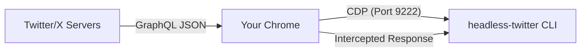

## The CDP Connection

`headless-twitter` connects to your **already running Chrome** using the **Chrome DevTools Protocol (CDP)**. This is a powerful, low-level interface that allows the tool to talk directly to your browser's internal engine.

Unlike traditional scrapers, `headless-twitter` doesn't "scrape" the DOM (HTML). Instead, it **intercepts the actual GraphQL responses** sent from Twitter's servers to your browser. This makes the data much more reliable and stable.

## 3-Layer Read-Only Enforcement

This tool is **architecturally incapable** of liking, retweeting, or posting. Security is not a promise; it's a structural guarantee.

<AccordionGroup>
  <Accordion title="Layer 1: Network-Level Blocks" icon="network-wired">
    We use CDP to intercept all network requests. Any request that isn't a `GET` (like `POST`, `PUT`, `DELETE`, or `PATCH`) is **blocked immediately** at the browser level. This means your browser never even attempts to send a "like" or "retweet" request to Twitter's servers.
  </Accordion>
  <Accordion title="Layer 2: DOM Interaction Freeze" icon="computer-mouse">
    Upon navigation, we inject a script into the page that **freezes all interaction events**. Clicks, form submissions, and input changes are disabled across the entire page. Even if an automated script tried to click a "post" button, the browser would ignore the event.
  </Accordion>
  <Accordion title="Layer 3: Zero-Mutation Code" icon="code">
    The source code contains **no calls** to `page.click()`, `page.fill()`, or `page.type()`. We only use `page.goto()` and `page.evaluate()` (for read-only data extraction). By design, the tool has no mechanism to perform actions.
  </Accordion>
</AccordionGroup>

## Performance & Stealth

Because it uses your real Chrome profile:
1. **No Bot Detection**: To Twitter, it looks like your regular browser is simply scrolling through the feed.
2. **Instant Connect**: Since Chrome stays running, subsequent runs connect and start fetching in **less than 1 second**.
3. **High Fidelity**: You see exactly what you'd see in your own browser — no need to deal with headless browser fingerprints or complex anti-bot measures.

---

<Card title="CLI Flags" icon="terminal" href="/api-reference/cli">
  View every command-line option available.
</Card>
