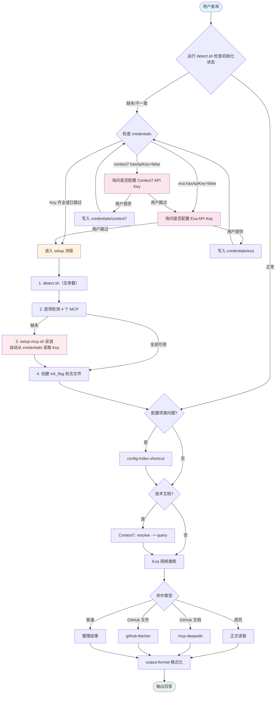

# Search-Web

集成多源搜索的技术查询技能，整合 Context7 文档查询、Exa 网络搜索、DeepWiki 仓库文档和 github-fetcher 仓库文件读取。

## 前置条件

### 必需的 MCP 服务器

| MCP 工具 | 用途 | 类型 |
|----------|------|------|
| **context7** | 技术文档和代码示例查询 | stdio (npx) |
| **exa** | 网络搜索 | 远程 HTTP |
| **mcp-deepwiki** | GitHub 仓库文档查询 | stdio (npx) |
| **github-fetcher** | GitHub 仓库文件与目录读取 | stdio (npx) |

### 支持的 Code Agent

- Claude Code
- Codex
- OpenCode
- QwenCode

### 验证安装

- 直接询问 code agent 有哪些 skills
- 或运行 `bash scripts/detect.sh` 确认宿主识别正常

## 整体流程



## 手动初始化

首次使用前，需确保 4 个必需 MCP 已安装：

```bash
# 1. 检测环境（agent、os、state_dir、initialized 四项一次输出）
bash scripts/detect.sh

# 2. 使用脚本安装 MCP（推荐）
bash scripts/setup-mcp.sh --mcp context7
bash scripts/setup-mcp.sh --mcp exa
bash scripts/setup-mcp.sh --mcp mcp-deepwiki
bash scripts/setup-mcp.sh --mcp github-fetcher

# 或手动按宿主类型配置（见 references/setup.md）
```

完整初始化指南见 `references/setup.md`。

## MCP 使用边界

| 搜索目标 | 使用的 MCP | 说明 |
|---------|-----------|------|
| 技术文档 | Context7 | 固定顺序：先 resolve-library-id 再 query-docs |
| 网络搜索 | Exa | 不得使用其他搜索型 MCP 替代 |
| GitHub 仓库文档 | mcp-deepwiki | 仓库级别的文档概览和深读 |
| GitHub 仓库文件/目录 | github-fetcher | 读取具体文件内容或目录结构 |
| 网页正文 | 宿主提供的读取工具 | 仅在已知 URL 后使用，不能替代 Exa |

## 目录结构

```
search-web/
├── SKILL.md                              # 技能主文件
├── README.md                             # 本文件
├── scripts/
│   ├── detect.sh                         # 统一环境检测脚本（agent/os/state-dir）
│   └── setup-mcp.sh                      # MCP 安装脚本
├── references/
│   ├── setup.md                          # 初始化配置指南
│   ├── rules/
│   │   └── output-format.md              # 输出格式规范
│   └── strategies/
│       └── config-index-shortcut.md      # 配置索引直达策略
└── examples/
    └── usage.md                          # 使用示例
```
