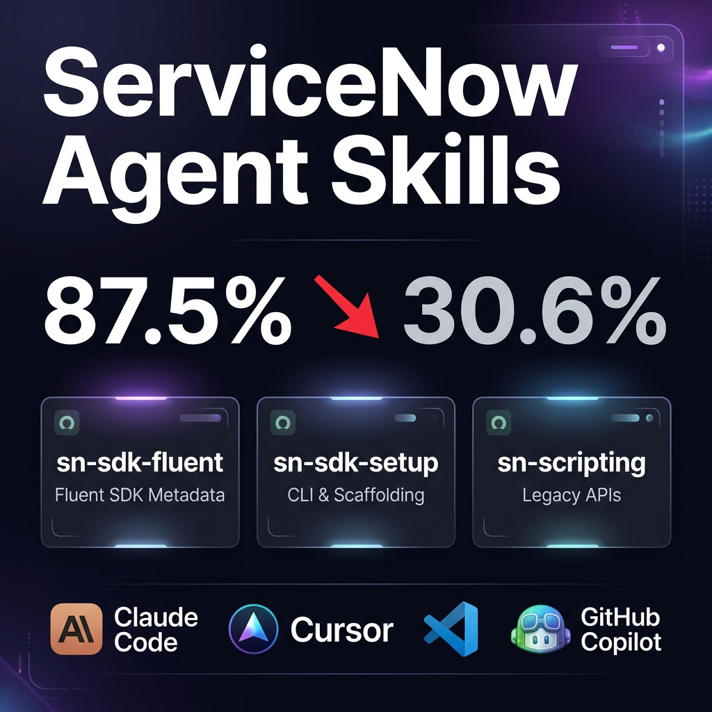
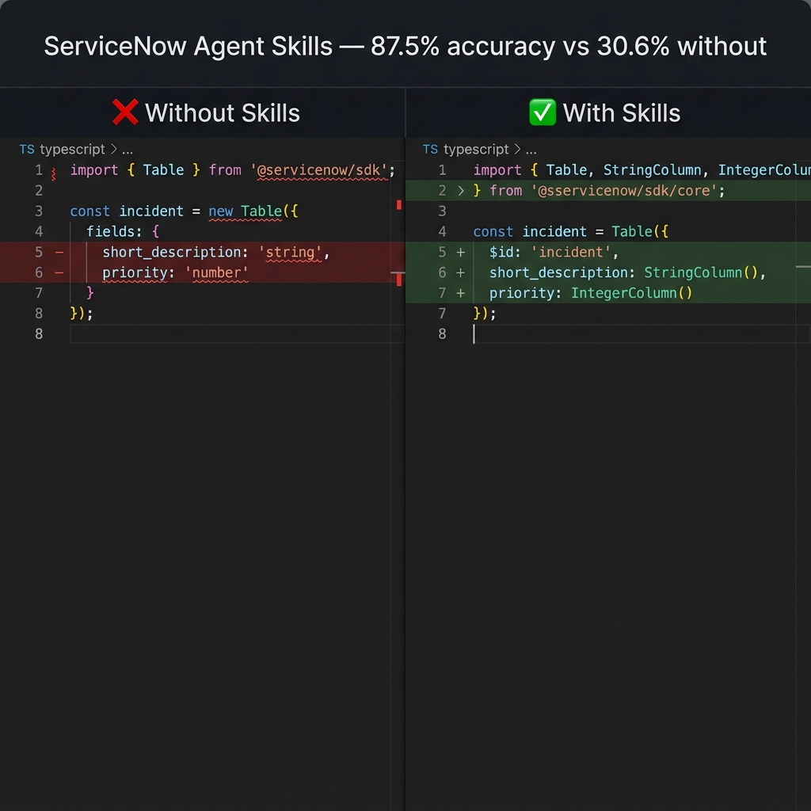
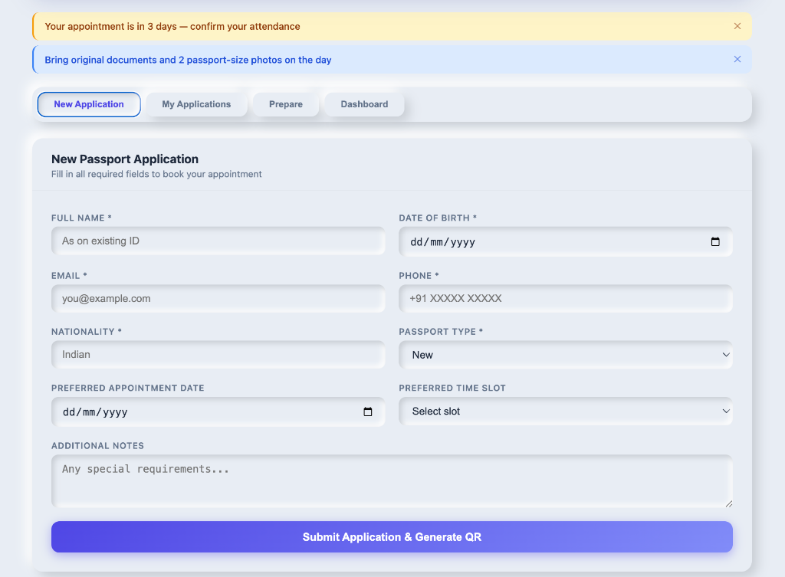

# servicenow-agent-skills

> 87.5% pass rate with skills vs 30.6% without — on ServiceNow SDK code generation tasks

Agent skills that give every AI coding tool expert-level knowledge of the ServiceNow SDK. Drop them into Claude Code, Cursor, VS Code Copilot, or any compatible tool and get accurate, spec-compliant code generation immediately.




## What's Inside?

The suite contains three massive, deeply-researched knowledge bases designed to prevent AI hallucinations across the entire ServiceNow development ecosystem:

| Skill | Included Knowledge & Capabilities |
|-------|-----------------------------------|
| **[sn-sdk-fluent](./sn-sdk-fluent/)** | **Fluent SDK Metadata (.now.ts):** Tables, Columns, ACLs, Flow Designer triggers, UI Actions, Business Rules, and Service Portal Widgets. |
| **[sn-sdk-setup](./sn-sdk-setup/)** | **CLI & Scaffolding:** `now-sdk` commands, OAuth/Basic auth profile generation, project architecture, and environment configuration. |
| **[sn-scripting](./sn-scripting/)** | **APIs & Logic:** GlideRecord (CRUD & querying), Script Includes, Client Scripts, UI Policies, `g_form` APIs, and Server/Client execution boundaries. |

## What You Can Build

Because these skills prevent hallucinations across both Server-side and Client-side architecture, your agent can confidently scaffold real, deployable enterprise applications.



*An example complex application architecture built entirely by AI utilizing these skills.*

## Try These Prompts

Once installed, your AI agent transforms from a generic code assistant into a senior ServiceNow developer. Try using these prompts:

- *"Scaffold a new ServiceNow app that integrates with an external OAuth provider."*
- *"Create a Business Rule that triggers on Incident creation and updates the parent problem. Use the Fluent SDK."*
- *"Build a Service Portal widget with a client controller that queries the sys_user table."*
- *"Write an advanced GlideRecord query to find all active tickets older than 30 days and update their state."*

## Install

### One-liner (macOS + Linux)

```sh
curl -fsSL https://raw.githubusercontent.com/aatrey882/servicenow-agent-skills/main/install.sh | sh
```

### npx skills (skills.sh registry)

```sh
npx skills add aatrey882/servicenow-agent-skills
```

### Manual copy

```sh
cp -r sn-sdk-fluent sn-sdk-setup sn-scripting ~/.agents/skills/
```

## Compatible Tools

Claude Code · Antigravity · Cursor · VS Code Copilot · Codex

## Activation

After installation, activate skills in your tool of choice:

| Tool | How to activate |
|------|----------------|
| Antigravity | Automatic — skills load from `~/.gemini/antigravity/skills/` |
| Claude Code | Automatic — skills load from `~/.claude/skills/` |
| Cursor | Add `SKILL.md` content to `.cursorrules` or `.cursor/rules/` |
| VS Code Copilot | Add `SKILL.md` content to `.github/copilot-instructions.md` |

## Before / After

Without the `sn-sdk-fluent` skill, AI tools hallucinate wrong import paths and invalid field types:

```typescript
// ❌ Without sn-sdk-fluent
import { Table } from '@servicenow/sdk';  // wrong import path

const incident = new Table({
  fields: { short_description: 'string', priority: 'number' }  // wrong types
});
```

With the skill installed, the output matches the Fluent SDK spec exactly:

```typescript
// ✓ With sn-sdk-fluent
import { Table, StringColumn, IntegerColumn } from '@servicenow/sdk/core';

const incident = Table({
  $id: 'incident',
  short_description: StringColumn(),
  priority: IntegerColumn(),
});
```

## How It Works (Performance First)

This isn't just a massive prompt dumped into your chat. These skills utilize a **Progressive Disclosure** architecture. 

The main `SKILL.md` files act exclusively as routing tables. When Claude or Cursor needs to write a Business Rule, the skill dynamically reads *only* the specific `references/server-side.md` file required for that task. This keeps your context window incredibly small, saves money on token usage, and provides high-density context to entirely eliminate framework hallucinations.

## Contributors

A special thanks to **Claude Code** and the **Antigravity** engine as core contributors for their role in architecting, generating, and reviewing the reference material and showcase applications built within this repository. 

## License

MIT

---

**Personal Note: I built this suite on the weekends as a passion project to explore the bleeding edge of AI and ServiceNow architecture. It is purely for educational and learning purposes. The code, methodologies, and opinions expressed in this repository are strictly my own and do not reflect the views or positions of my employer.**
