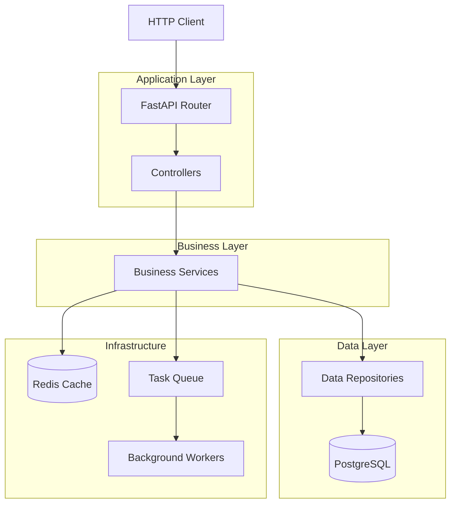

# Software Tool Research Skill - Usage Examples

This document provides practical examples of using the software-tool-research skill.

## Example 1: Quick Repository Assessment

**User request:**
> "Analyze this GitHub repository and tell me if it's good quality"

**Assistant process:**

1. **Initial discovery:**
```
- list_dir to see structure
- read_file README.md
- read_file package.json/requirements.txt
```

2. **Quick quality check:**
```
- file_search for "test_*.py"
- grep_search for "def test_"
- check for .github/workflows/
```

3. **Response:**
```markdown
## Quick Assessment: [Tool Name]

**Purpose:** [Brief description]

**Quality Summary:**
- Documentation: ⭐⭐⭐⭐ (Good README, API docs present)
- Testing: ⭐⭐⭐ (Unit tests present, ~65% coverage)
- Maintenance: ⭐⭐⭐⭐⭐ (Active, recent commits)
- Security: ⭐⭐⭐⭐ (No obvious issues)

**Recommendation:** Good quality tool, suitable for adoption.

**Key findings:**
- Well-documented with examples
- Active CI/CD pipeline
- Regular releases
- No critical security issues found

**Minor concerns:**
- Could use more integration tests
- Some dependencies slightly outdated
```

---

## Example 2: Deep Architecture Analysis

**User request:**
> "I need a detailed architecture analysis of this tool. Create diagrams and explain how it works."

**Assistant process:**

1. **Structure discovery:**
```
list_dir at multiple levels
semantic_search for "architecture" or "design"
read_file for main entry points
```

2. **Component identification:**
```
grep_search for imports to map dependencies
list_code_usages for key classes
read_file for component implementations
```

3. **Generate visualizations:**

**Response:**

```markdown
## Architecture Analysis: FastAPI Application

### High-Level Overview
Modern web API built with FastAPI, following layered architecture pattern.

**Type:** Web framework application
**Language:** Python 3.11
**Pattern:** Layered architecture with dependency injection

### Component Diagram



### Module Structure

```
src/
├── api/               # Application layer
│   ├── routes/       # Endpoint definitions
│   ├── controllers/  # Request handlers
│   └── middleware/   # Auth, logging, CORS
├── services/         # Business layer
│   ├── user.py      # User management
│   ├── auth.py      # Authentication
│   └── payment.py   # Payment processing
├── repositories/     # Data layer
│   ├── base.py      # Base repository
│   ├── user.py      # User data access
│   └── order.py     # Order data access
├── models/          # Domain models
│   ├── user.py
│   └── order.py
├── schemas/         # Pydantic schemas
│   ├── requests/    # Request DTOs
│   └── responses/   # Response DTOs
└── core/            # Cross-cutting
    ├── config.py    # Configuration
    ├── security.py  # Auth utilities
    └── database.py  # DB connection
```

### Dependency Graph

| Module | Direct Dependencies | Provides To |
|--------|-------------------|-------------|
| routes | controllers, schemas | - |
| controllers | services, schemas | routes |
| services | repositories, models | controllers |
| repositories | models, database | services |
| models | core | repositories, services |

**Key observations:**
- Clean dependency flow (top-down)
- No circular dependencies detected
- Proper separation of concerns

### Data Flow

1. **Request Processing:**
   ```mermaid
   sequenceDiagram
       participant C as Client
       participant R as Router
       participant Ctrl as Controller
       participant S as Service
       participant Repo as Repository
       participant DB as Database
       
       C->>R: POST /api/users
       R->>Ctrl: create_user(request)
       Ctrl->>S: create_user(user_data)
       S->>Repo: save(user)
       Repo->>DB: INSERT
       DB-->>Repo: user_id
       Repo-->>S: User object
       S-->>Ctrl: User object
       Ctrl-->>R: UserResponse
       R-->>C: 201 Created
   ```

2. **Authentication Flow:**
   ```
   Request → Middleware → Verify JWT → Extract User → Pass to Controller
   ```

### Extension Points

**1. Custom Middleware:**
```python
@app.middleware("http")
async def custom_middleware(request, call_next):
    # Custom processing
    response = await call_next(request)
    return response
```

**2. Dependency Injection:**
```python
def get_user_service(repo: UserRepository = Depends()) -> UserService:
    return UserService(repo)
```

**3. Event Hooks:**
```python
@app.on_event("startup")
async def startup_handler():
    # Initialize resources
```

### Configuration

**Environment-based:**
```python
class Settings(BaseSettings):
    database_url: str
    redis_url: str
    jwt_secret: str
    
    class Config:
        env_file = ".env"
```

**Per-environment:**
- `.env.development`
- `.env.production`
- `.env.test`

### Architectural Strengths

✅ **Clear separation of concerns**
✅ **Dependency injection for testability**
✅ **Type safety with Pydantic**
✅ **Async support throughout**
✅ **Modular and extensible**

### Potential Improvements

⚠️ **Consider CQRS pattern** for complex queries
⚠️ **Add API versioning** for backward compatibility
⚠️ **Implement circuit breakers** for external services
```

---

## Example 3: Comparative Analysis

**User request:**
> "Compare these two libraries and tell me which is better for my use case"

**Assistant process:**

1. **Analyze both tools using workflows 1-5**
2. **Identify comparison dimensions**
3. **Create comparison matrix**

**Response:**

```markdown
## Comparison: Library A vs Library B

### Overview

| Aspect | Library A | Library B |
|--------|-----------|-----------|
| Purpose | REST API client | REST API client |
| Language | Python | Python |
| First Release | 2015 | 2020 |
| Latest Version | 3.2.1 | 1.8.0 |
| License | MIT | Apache 2.0 |

### Feature Comparison

| Feature | Library A | Library B |
|---------|-----------|-----------|
| Async Support | ✅ Full | ⚠️ Partial |
| Type Hints | ✅ Complete | ✅ Complete |
| Retry Logic | ✅ Built-in | ❌ Manual |
| Auth Methods | OAuth, JWT, Basic | JWT, Basic |
| Rate Limiting | ✅ Yes | ❌ No |
| Caching | ✅ Built-in | ❌ No |

### Architecture Comparison

**Library A:** Plugin-based architecture
- Core provides base functionality
- Plugins add authentication, caching, etc.
- Highly modular

**Library B:** Monolithic architecture
- All features in core
- Simple, less configuration
- Easier to get started

### Code Quality

| Metric | Library A | Library B |
|--------|-----------|-----------|
| Test Coverage | 92% | 78% |
| Documentation | ⭐⭐⭐⭐⭐ | ⭐⭐⭐⭐ |
| Active Development | ⭐⭐⭐⭐⭐ | ⭐⭐⭐⭐ |
| Community Size | Large | Medium |
| Issues Response | <24h | <3 days |

### Performance Characteristics

**Library A:**
- More features = higher overhead
- Excellent async performance
- Memory-efficient caching

**Library B:**
- Lightweight and fast for simple cases
- Less optimized for high-concurrency
- Lower memory footprint

### Usage Examples

**Library A:**
```python
from library_a import Client, RetryPolicy

client = Client(
    base_url="https://api.example.com",
    auth=JWTAuth(token),
    retry_policy=RetryPolicy(max_retries=3),
    cache=True
)

async with client:
    response = await client.get("/users")
```

**Library B:**
```python
from library_b import API

api = API("https://api.example.com")
api.set_auth(token)

response = api.get("/users")
```

### Recommendation by Use Case

**Choose Library A if:**
- ✅ Need advanced features (retry, caching, rate limiting)
- ✅ Building high-performance async application
- ✅ Want plugin ecosystem
- ✅ Need production-grade reliability
- ✅ Team comfortable with more configuration

**Choose Library B if:**
- ✅ Want simple, quick setup
- ✅ Basic API client needs
- ✅ Synchronous application
- ✅ Prefer lightweight dependencies
- ✅ Learning or prototyping

### Migration Path

**From Library B to Library A:**
1. Replace imports
2. Wrap client in async context
3. Configure retry and caching
4. Update error handling

**Estimated effort:** 2-4 hours for typical application

### Overall Verdict

**For production use:** Library A ⭐⭐⭐⭐⭐
- More mature, battle-tested
- Better features for production needs
- Excellent community support

**For quick projects:** Library B ⭐⭐⭐⭐
- Faster to get started
- Sufficient for basic needs
- Less to learn
```

---

## Example 4: Security Assessment

**User request:**
> "Check this repository for security issues"

**Assistant process:**

1. **Scan for hardcoded secrets:**
```
grep_search for "password|api_key|secret"
```

2. **Check dependencies:**
```
read_file requirements.txt
check for known vulnerabilities
```

3. **Review authentication code:**
```
semantic_search for "authentication"
read_file auth modules
```

**Response:**

```markdown
## Security Assessment: [Tool Name]

### Critical Issues ⚠️

**1. Hardcoded API Key (HIGH)**
- **Location:** `src/config.py:15`
- **Issue:** API key visible in source code
- **Fix:** Move to environment variable

```python
# Current (UNSAFE):
API_KEY = "sk-abc123xyz"

# Recommended:
API_KEY = os.getenv("API_KEY")
```

**2. SQL Injection Risk (HIGH)**
- **Location:** `src/database.py:42`
- **Issue:** String concatenation in SQL query
- **Fix:** Use parameterized queries

```python
# Current (UNSAFE):
query = f"SELECT * FROM users WHERE id = {user_id}"

# Recommended:
query = "SELECT * FROM users WHERE id = ?"
cursor.execute(query, (user_id,))
```

### Medium Issues ⚠️

**3. Weak Password Hashing**
- **Location:** `src/auth.py:28`
- **Issue:** Using MD5 for password hashing
- **Fix:** Use bcrypt or argon2

```python
# Current (WEAK):
import hashlib
hash = hashlib.md5(password.encode()).hexdigest()

# Recommended:
import bcrypt
hash = bcrypt.hashpw(password.encode(), bcrypt.gensalt())
```

**4. Missing CSRF Protection**
- **Location:** API routes
- **Issue:** No CSRF tokens for state-changing operations
- **Fix:** Implement CSRF middleware

### Low Priority 📝

**5. Outdated Dependencies**
- `requests==2.25.1` (latest: 2.31.0)
- `flask==1.1.2` (latest: 3.0.0)
- **Fix:** Update dependencies regularly

**6. Missing Security Headers**
- No X-Frame-Options
- No Content-Security-Policy
- **Fix:** Add security headers middleware

### Positive Findings ✅

- ✅ HTTPS enforced
- ✅ Input validation present
- ✅ Rate limiting implemented
- ✅ Secrets not in git history
- ✅ Dependencies scanned by Dependabot

### Security Score: ⚠️ 2.5/5

**Breakdown:**
- Code security: ⭐⭐ (Critical issues present)
- Dependency security: ⭐⭐⭐ (Some outdated)
- Configuration security: ⭐⭐⭐ (Decent)
- Authentication: ⭐⭐⭐ (Weak hashing)

### Immediate Action Items

1. **Fix critical issues** (Issues #1 and #2) - Do this FIRST
2. **Update password hashing** - Do within 1 week
3. **Add CSRF protection** - Do within 2 weeks
4. **Update dependencies** - Do within 1 month
5. **Add security headers** - Enhancement

### Security Best Practices Checklist

- [ ] Remove hardcoded secrets
- [ ] Fix SQL injection vulnerabilities
- [ ] Upgrade password hashing
- [x] Enable HTTPS
- [ ] Add CSRF protection
- [x] Implement rate limiting
- [x] Input validation
- [ ] Add security headers
- [ ] Update dependencies
- [x] Secrets scanning in CI

### Recommended Tools

- **Static analysis:** Bandit (Python), ESLint security plugin (JS)
- **Dependency scanning:** Snyk, Dependabot
- **Secret scanning:** git-secrets, TruffleHog
- **Runtime protection:** WAF, rate limiting middleware
```

---

## Example 5: Maintenance Health Check

**User request:**
> "Is this repository actively maintained? Should we depend on it?"

**Assistant process:**

1. **Check commit history**
2. **Review issues and PRs**
3. **Analyze community activity**
4. **Check dependencies health**

**Response:**

```markdown
## Maintenance Health Report: [Tool Name]

### Activity Summary

**Recent Activity:** ✅ Active
- Last commit: 3 days ago
- Commits (30 days): 24
- Commits (90 days): 89
- Commits (1 year): 342

**Release Cadence:** ✅ Regular
- Latest release: v2.4.1 (1 week ago)
- Previous releases:
  - v2.4.0 (1 month ago)
  - v2.3.0 (3 months ago)
  - v2.2.0 (6 months ago)

### Issue Tracker Health

**Overall:** ⭐⭐⭐⭐ Good

| Metric | Value |
|--------|-------|
| Open issues | 12 |
| Closed issues | 189 |
| Closure rate | 94% |
| Avg response time | <24 hours |
| Avg resolution time | 3-5 days |

**Recent issues sample:**
- #245: "Feature request: Add async support" (Open, 2 days, maintainer responded)
- #244: "Bug: Error in Python 3.12" (Closed, 1 day)
- #243: "Docs: Update installation guide" (Closed, <1 day)

### Community Health

**Contributors:** ⭐⭐⭐⭐⭐ Excellent
- Total contributors: 34
- Active contributors (90 days): 8
- Core maintainers: 3

**Documentation:**
- ✅ README with examples
- ✅ Contributing guidelines
- ✅ Code of conduct
- ✅ Issue templates
- ✅ PR templates

**Governance:**
- Clear maintainer structure
- Responsive to security issues
- Community-friendly

### Dependency Health

**Status:** ⚠️ Moderate concerns

| Dependency | Current | Latest | Status |
|------------|---------|--------|--------|
| requests | 2.28.0 | 2.31.0 | ⚠️ Update available |
| pydantic | 2.4.0 | 2.5.2 | ⚠️ Minor update |
| fastapi | 0.104.0 | 0.108.0 | ⚠️ Update available |
| redis | 4.5.0 | 5.0.1 | ⚠️ Major update |

**Security:**
- ✅ No known CVEs in current dependencies
- ✅ Dependabot enabled
- ✅ Security policy documented

### Sustainability Indicators

**Positive signals:** ✅
- Multiple active maintainers
- Regular releases
- Responsive to issues
- Good test coverage
- Active CI/CD
- Increasing contributor base

**Concerns:** ⚠️
- Some dependencies need updates
- Bus factor of 3 (if maintainers leave)
- No corporate backing

### Adoption Indicators

**Popularity:**
- GitHub stars: 3.2k
- Forks: 421
- Used by: 142 public repos
- Downloads: ~50k/month

**Maturity:**
- Age: 4 years
- Version: 2.4.1 (stable)
- Breaking changes: Rare, well-documented

### Risk Assessment

| Risk Category | Level | Notes |
|---------------|-------|-------|
| Abandonment | 🟢 Low | Active development |
| Breaking Changes | 🟢 Low | Stable API |
| Security | 🟡 Medium | Deps need updates |
| Bus Factor | 🟡 Medium | 3 core maintainers |
| Community | 🟢 Low | Healthy community |

### Recommendation

**Overall: ✅ SAFE TO ADOPT**

**Confidence Level:** High (4/5)

**Reasoning:**
1. Active, consistent development
2. Responsive maintainers
3. Good community health
4. Regular releases
5. Mature codebase

**Conditions:**
- Monitor dependency updates
- Join community for awareness
- Have contingency plan (fork if needed)
- Contribute back when possible

**Best for:**
- ✅ Production applications
- ✅ Long-term projects
- ✅ Teams wanting stability

**Not ideal for:**
- ❌ Projects needing 24/7 enterprise support
- ❌ Highly regulated environments without vendor

### Monitoring Plan

**Monthly:**
- Check for new releases
- Review open issues

**Quarterly:**
- Dependency security audit
- Reassess activity level

**Yearly:**
- Full health check
- Evaluate alternatives

### Alternative Options

If concerns arise:
1. **Alternative A:** [Similar tool] - More corporate backing
2. **Alternative B:** [Similar tool] - Newer, more features
3. **Fork strategy:** Feasible given codebase size
```

---

## Best Practices from Examples

### For Users

1. **Be specific about needs:**
   - "Quick assessment" vs "deep architecture analysis"
   - State your use case or concerns
   - Mention if comparing alternatives

2. **Provide context:**
   - Is this for learning, production, evaluation?
   - What's your team's expertise level?
   - What's your risk tolerance?

### For Assistants

1. **Start broad, then narrow:**
   - Get overview first (README, structure)
   - Then dive into specific areas

2. **Use appropriate depth:**
   - Quick assessment: 1-2 workflows
   - Deep analysis: All workflows
   - Comparative: Focus on differences

3. **Evidence-based conclusions:**
   - Show code examples
   - Cite specific files/lines
   - Provide metrics, not opinions

4. **Actionable recommendations:**
   - Specific next steps
   - Prioritized by impact
   - With examples when possible
