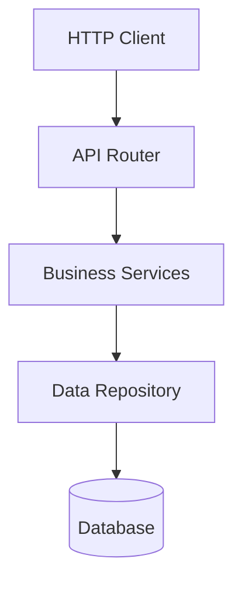

# Software Tool Research Skill

A comprehensive skill for analyzing software tools and repositories with focus on architecture understanding, quality assessment, and detailed reporting.

## Overview

This skill provides a systematic framework for investigating software tools, understanding their architecture, measuring quality metrics, and generating comprehensive analysis reports. Perfect for evaluating GitHub repositories, third-party libraries, or any software tool before adoption.

## What This Skill Does

### 🏗️ Architecture Analysis
- Identifies architectural patterns (MVC, microservices, layered, plugin-based, etc.)
- Maps component relationships and dependencies
- Traces data flow through the system
- Documents extension points and APIs

### 📊 Visual Modeling
- Generates component diagrams (Mermaid)
- Creates dependency graphs
- Produces sequence diagrams for key workflows
- Visualizes data flow pipelines

### 📈 Quality Measurement
- Code quality metrics (LOC, complexity, duplication)
- Documentation coverage assessment
- Testing metrics (coverage, types, CI/CD)
- Maintenance health indicators
- Security vulnerability scanning

### 📝 Comprehensive Reporting
- Executive summaries for stakeholders
- Technical deep-dives for engineers
- Comparative analyses between tools
- Risk assessments and recommendations

## When to Use This Skill

Use this skill when you need to:

- **Evaluate a tool for adoption** - Is this library/framework suitable for our project?
- **Understand existing code** - How does this repository work internally?
- **Compare alternatives** - Which tool is better for our use case?
- **Assess quality** - Is this codebase well-maintained and tested?
- **Check security** - Are there vulnerabilities or security issues?
- **Document architecture** - Generate diagrams and documentation for a tool
- **Due diligence** - Evaluate open-source dependencies for production use

## Example Use Cases

### Quick Assessment
```
"Analyze this GitHub repository and tell me if it's good quality"
```
→ Provides quality scores, key findings, and adoption recommendation

### Deep Dive
```
"Create a detailed architecture analysis with diagrams showing how this tool works"
```
→ Generates component diagrams, dependency graphs, and architectural documentation

### Comparison
```
"Compare Library A vs Library B and recommend which is better for building REST APIs"
```
→ Feature comparison matrix, code quality comparison, and use-case recommendations

### Security Audit
```
"Check this repository for security vulnerabilities"
```
→ Lists security issues by priority with fix recommendations

### Maintenance Check
```
"Is this repository actively maintained? Should we depend on it?"
```
→ Activity metrics, risk assessment, and adoption recommendation

## Skill Structure

```
software-tool-research/
├── SKILL.md                           # Main skill instructions
├── EXAMPLES.md                        # Practical usage examples
├── README.md                          # This file
└── references/
    ├── ARCHITECTURE_PATTERNS.md       # Pattern identification guide
    ├── MODELING_GUIDE.md              # Diagram creation techniques
    └── METRICS_GUIDE.md               # Quality measurement standards
```

## Core Workflows

1. **Repository Discovery** - Initial structure and technology identification
2. **Architecture Understanding** - Pattern recognition and component mapping
3. **Architectural Model Generation** - Visual diagram creation
4. **Functional Analysis** - Feature documentation and API surface
5. **Quality Metrics Measurement** - Comprehensive quality scoring
6. **Report Generation** - Structured analysis reports

## Output Examples

### Architecture Diagram


### Quality Score Card
```
Overall Quality: ⭐⭐⭐⭐ (4.0/5)

Documentation: ⭐⭐⭐⭐⭐ (5/5)
Testing:       ⭐⭐⭐⭐  (4/5)
Code Quality:  ⭐⭐⭐⭐  (4/5)
Maintenance:   ⭐⭐⭐⭐⭐ (5/5)
Security:      ⭐⭐⭐   (3/5)
```

### Comparison Matrix
| Feature | Tool A | Tool B |
|---------|--------|--------|
| Async Support | ✅ | ❌ |
| Type Safety | ✅ | ✅ |
| Documentation | ⭐⭐⭐⭐⭐ | ⭐⭐⭐ |
| Test Coverage | 92% | 65% |

## Key Features

### 🎯 Systematic Approach
Follows structured workflows ensuring no important aspects are missed

### 📐 Multiple Visualization Types
Component diagrams, dependency graphs, sequence diagrams, and data flows

### 📊 Quantitative Metrics
Evidence-based scoring using measurable indicators

### 🔍 Security Focus
Identifies hardcoded secrets, SQL injection risks, and vulnerable dependencies

### 🔄 Comparison Support
Side-by-side analysis of multiple tools with recommendation matrix

### 📖 Rich Documentation
Comprehensive reference guides for patterns, modeling, and metrics

## Limitations

- **Static analysis only** - Cannot execute code to measure runtime performance
- **No external API calls** - Cannot check npm/PyPI download statistics
- **Snapshot in time** - Metrics reflect current state, not historical trends
- **Context dependent** - Quality standards may vary by project type and size

## Best Practices

### For Quick Assessments
1. Start with README and package files
2. Check for tests and CI/CD
3. Verify recent activity
4. Look for obvious security issues

### For Deep Analysis
1. Execute all 6 core workflows systematically
2. Generate multiple diagram types
3. Measure all quality dimensions
4. Provide detailed evidence for conclusions

### For Comparisons
1. Use consistent evaluation criteria
2. Test both tools with same use cases
3. Consider team expertise and context
4. Provide clear recommendations

## Integration with Other Skills

Works well with:
- **arxiv-research** - For researching software engineering papers about tools
- **mcp-builder** - For understanding MCP server implementations
- **skill-creator** - For documenting skills as software tools

## Updates and Maintenance

This skill is maintained as part of the Research-MCP project. For updates or improvements, see the main repository.

## License

MIT License - See project LICENSE file for details.

---

**Version:** 1.0.0  
**Created:** January 2025  
**Last Updated:** January 2025
