# Architectural Modeling Guide

Techniques for creating accurate and useful architectural models from code analysis.

## Table of Contents
- [Component Diagrams](#component-diagrams)
- [Dependency Graphs](#dependency-graphs)
- [Sequence Diagrams](#sequence-diagrams)
- [Data Flow Diagrams](#data-flow-diagrams)
- [Class Diagrams](#class-diagrams)

## Component Diagrams

Visualize major system components and their relationships.

### When to Use
- High-level architecture overview
- Understanding component responsibilities
- Identifying coupling between components

### Mermaid Syntax

**Basic Component Diagram:**
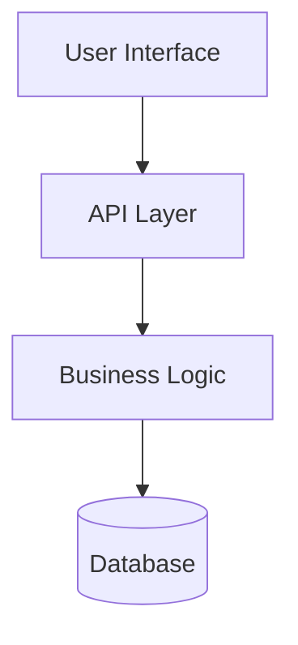

**With Multiple Connections:**
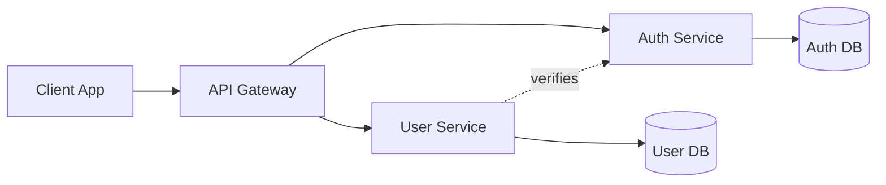

**Styling for Clarity:**
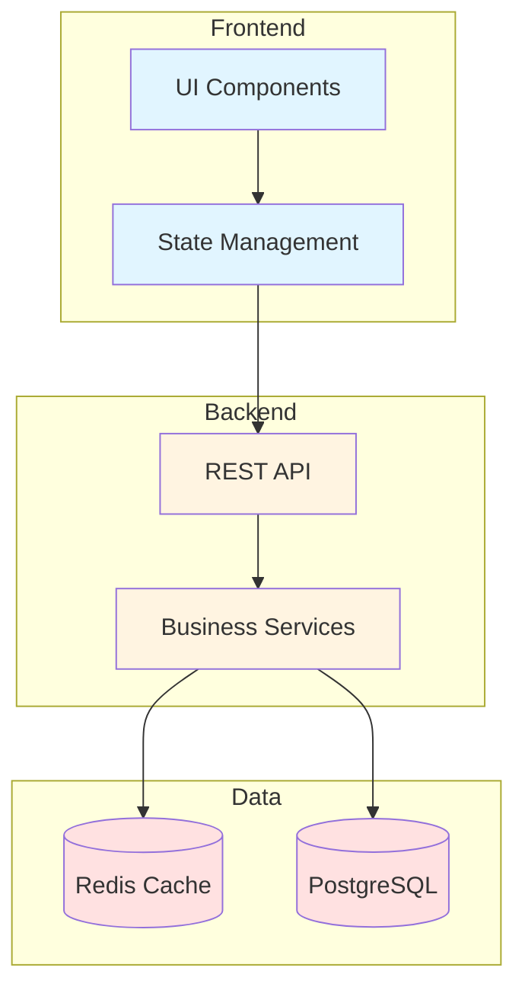

### Discovery Process

1. **Identify components:**
   - Use `list_dir` to see top-level structure
   - Look for logical groupings (folders, modules)
   - Read main entry points to find initialization

2. **Map relationships:**
   - Use `grep_search` for imports between components
   - Check for dependency injection configurations
   - Look at interface definitions

3. **Document responsibilities:**
   - Read README or inline comments
   - Examine main classes/functions in each component
   - Review tests to understand expected behavior

### Example Analysis Code

```markdown
## Component Discovery

### Step 1: List Structure
Components found:
- `src/frontend/` - UI code
- `src/api/` - REST endpoints
- `src/services/` - Business logic
- `src/models/` - Data structures
- `src/storage/` - Database access

### Step 2: Find Dependencies
```grep_search: "from src.services import"```
Results show API depends on services.

```grep_search: "from src.storage import"```
Results show services depend on storage.

### Step 3: Generate Diagram
[Mermaid diagram here]
```

## Dependency Graphs

Show how code modules depend on each other.

### When to Use
- Understanding coupling and cohesion
- Identifying circular dependencies
- Planning refactoring
- Analyzing impact of changes

### Visualization Options

**Table Format:**
| Module | Direct Dependencies | Dependents |
|--------|-------------------|------------|
| core | utils, config | services, api |
| services | core, models | api, cli |
| api | services, auth | - |
| models | core | services, storage |

**Tree Format:**
```
api/
├─ services/
│  ├─ core/
│  │  └─ utils/
│  └─ models/
│     └─ core/
└─ auth/
   └─ core/
```

**Graph Format:**
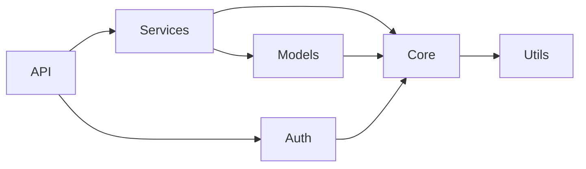

### Discovery Process

1. **Map imports:**
   - Use `grep_search` with patterns like `^import|^from`
   - For Python: look for `from X import Y`
   - For JavaScript: look for `import ... from`
   - For Java: look for `import` statements

2. **Identify external dependencies:**
   - Read package.json, requirements.txt, pom.xml
   - Separate standard library from third-party
   - Note version constraints

3. **Analyze depth:**
   - Count levels of dependency
   - Identify leaf nodes (no dependencies)
   - Find root nodes (many dependents)

### Detecting Issues

**Circular Dependencies:**
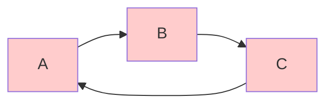
Look for import cycles that can cause initialization problems.

**Excessive Coupling:**
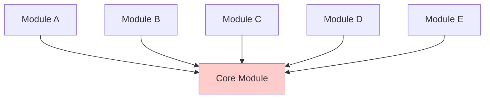
A module with too many dependents may need splitting.

## Sequence Diagrams

Show interaction flow over time.

### When to Use
- Understanding request/response flow
- Documenting API workflows
- Debugging complex interactions
- Explaining initialization sequences

### Mermaid Syntax

**Basic Request Flow:**
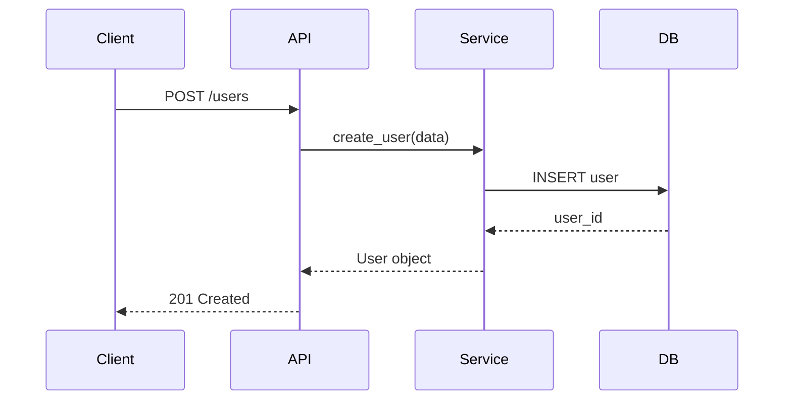

**With Error Handling:**
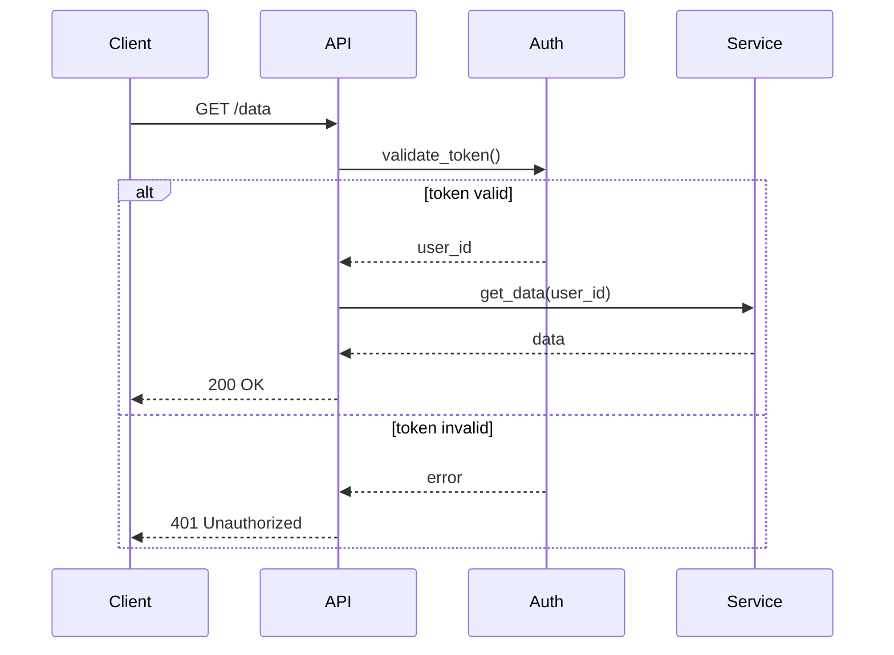

**Async Operations:**
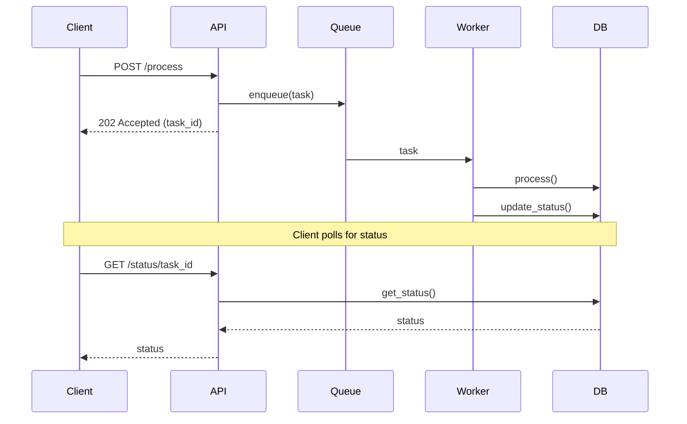

### Discovery Process

1. **Identify entry point:**
   - Find main function or route handler
   - Read API documentation or route definitions

2. **Trace execution:**
   - Follow function calls through code
   - Note async/await or callbacks
   - Check for error handling paths

3. **Document interactions:**
   - List participants (objects, services)
   - Note message types (sync, async, return)
   - Capture alternative flows (errors, conditionals)

## Data Flow Diagrams

Show how data moves through the system.

### When to Use
- Understanding data transformations
- Documenting ETL processes
- Analyzing pipeline architectures
- Planning data governance

### Notation

**Simple Flow:**
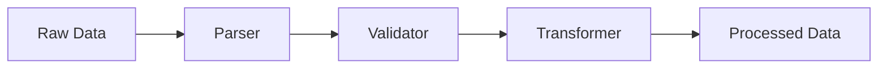

**With Branching:**
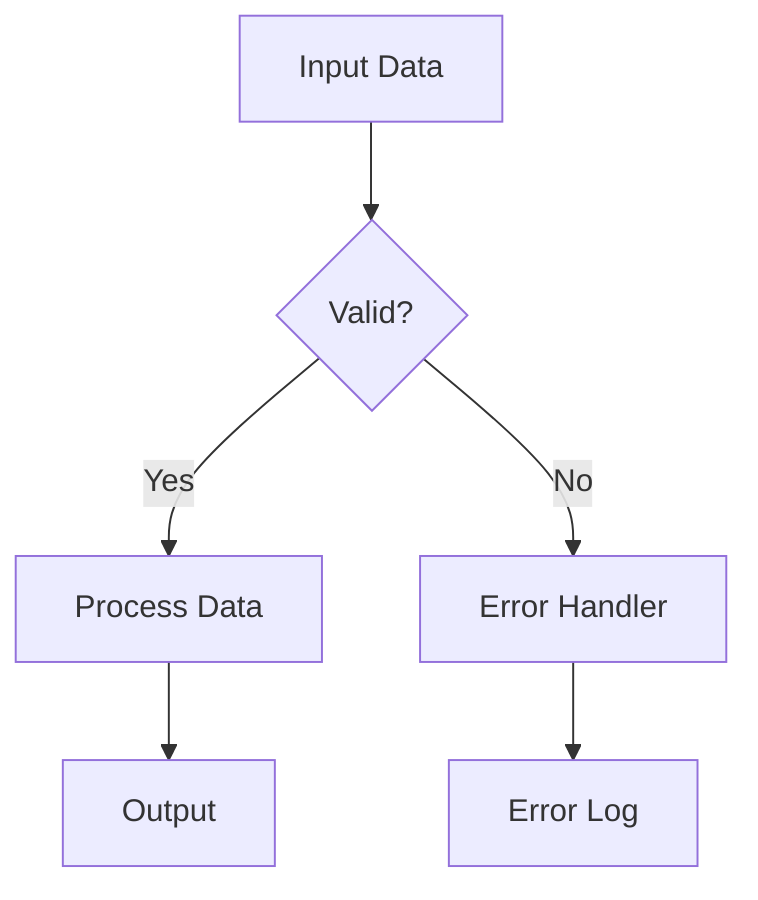

**Multi-stage Pipeline:**
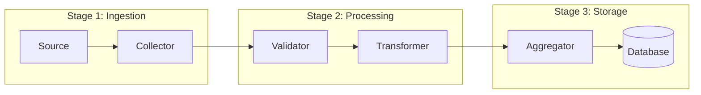

### Discovery Process

1. **Identify data sources:**
   - Files, databases, APIs, user input
   - Read configuration for data connections

2. **Trace transformations:**
   - Look for functions that modify data
   - Check for validation, parsing, mapping
   - Note where data format changes

3. **Find data sinks:**
   - Where data is written/output
   - Storage locations, APIs, files

## Class Diagrams

Show object-oriented structure and relationships.

### When to Use
- Understanding OOP design
- Documenting domain models
- Analyzing inheritance hierarchies
- Planning refactoring of class structure

### Mermaid Syntax

**Basic Class Structure:**
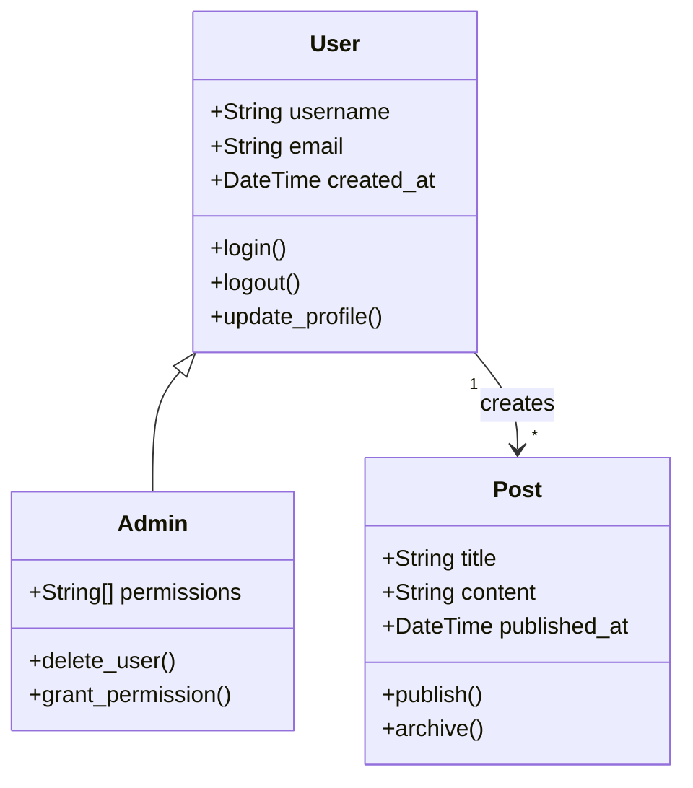

**With Interfaces:**
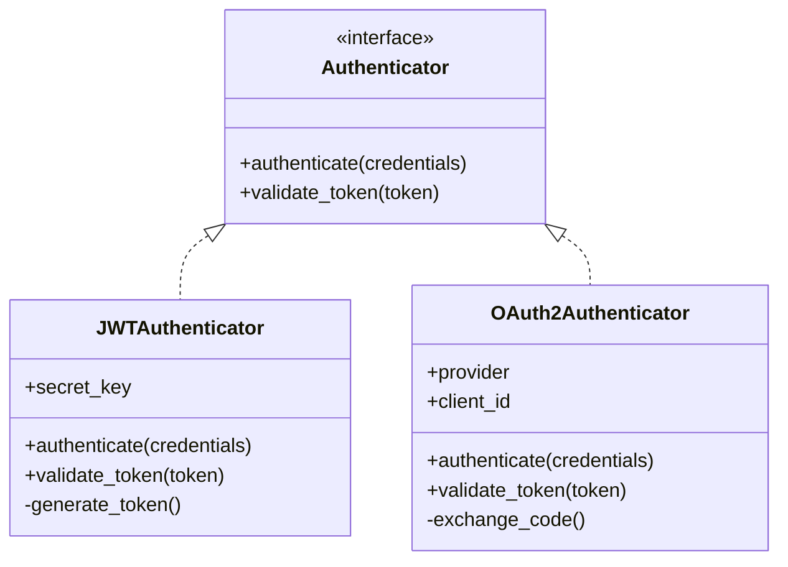

### Discovery Process

1. **Find class definitions:**
   - Use `grep_search` for `class ` pattern
   - Look in models/, domain/, entities/

2. **Extract attributes and methods:**
   - Read class definitions
   - Note public vs private members
   - Identify class vs instance methods

3. **Map relationships:**
   - Inheritance: `class Child(Parent)`
   - Composition: Class has instance of another
   - Association: Class references another

## Best Practices

### Choosing the Right Diagram

- **Component**: High-level system overview
- **Dependency**: Module coupling analysis
- **Sequence**: Request flow and interactions
- **Data Flow**: Data transformation pipeline
- **Class**: Object-oriented domain modeling

### Diagram Complexity

**Keep diagrams focused:**
- One diagram per concept/workflow
- Maximum 7-10 elements per diagram
- Use subgraphs to group related items
- Create multiple views for complex systems

**Progressive disclosure:**
1. High-level overview diagram
2. Detailed diagrams for each component
3. Code-level diagrams for complex parts

### Validation

**Verify accuracy:**
- Cross-reference with code
- Test understanding by tracing execution
- Review with generated tests in mind
- Check against documentation

**Keep updated:**
- Note analysis date
- Link to specific commit/version
- Mark as "snapshot" not "specification"

## Tools Integration

### Using Copilot Tools

**For Component Discovery:**
```
1. list_dir("/path/to/project")
2. semantic_search("component initialization")
3. read_file for main entry points
4. grep_search for import patterns
```

**For Dependency Mapping:**
```
1. grep_search("^from |^import ", isRegexp=true)
2. read package.json/requirements.txt
3. list_code_usages for specific classes
```

**For Sequence Tracing:**
```
1. semantic_search("API endpoint handler")
2. read_file for route definitions
3. Follow function calls with read_file
4. Check tests for expected flow
```

### Code Markers to Look For

**Architecture clues:**
- `__init__.py` files (Python package structure)
- `index.ts` exports (JavaScript module structure)
- `@Injectable`, `@Component` (Dependency injection)
- `interface`, `abstract class` (Contracts)

**Relationship clues:**
- Import statements (dependencies)
- Constructor parameters (composition)
- Base class in definition (inheritance)
- Callback/event registration (pub-sub)
