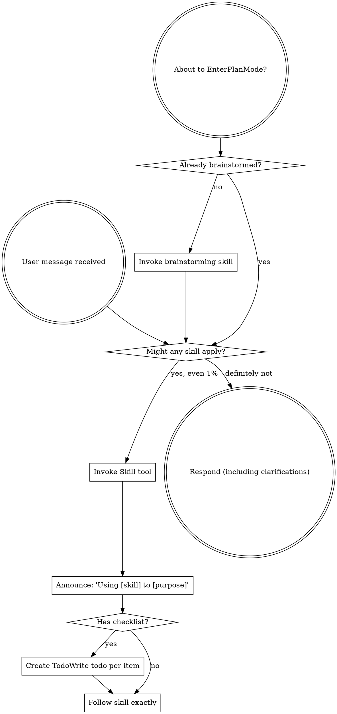

<EXTREMELY-IMPORTANT>
If you think there is even a 1% chance a skill might apply to what you are doing, you ABSOLUTELY MUST invoke the skill.

IF A SKILL APPLIES TO YOUR TASK, YOU DO NOT HAVE A CHOICE. YOU MUST USE IT.

This is not negotiable. This is not optional. You cannot rationalize your way out of this.
</EXTREMELY-IMPORTANT>

## How to Access Skills

- **Claude Code:** Use the native `Skill` tool when it is available. When the host loads a skill into context for you, follow that loaded content directly instead of manually reading the skill file.
- **Codex:** Keep shared skills in the configured skills directory and invoke the matching skill workflow before acting.
- **Gemini CLI:** Use the generated `/skills:<skill-name>` command or the equivalent global skill folder integration provided by the current setup.
- **GitHub Copilot and similar clients:** Use the client's supported skill, instruction, or plugin path so the workflow is available before you start work.

# Using Skills

## The Rule

**Invoke relevant or requested skills BEFORE any response or action.** Even a 1% chance a skill might apply means that you should invoke the skill to check. If an invoked skill turns out to be wrong for the situation, you don't need to use it.

## Red Flags

These thoughts mean STOP—you're rationalizing:

| Thought | Reality |
|---------|---------|
| "This is just a simple question" | Questions are tasks. Check for skills. |
| "I need more context first" | Skill check comes BEFORE clarifying questions. |
| "Let me explore the codebase first" | Skills tell you HOW to explore. Check first. |
| "I can check git/files quickly" | Files lack conversation context. Check for skills. |
| "Let me gather information first" | Skills tell you HOW to gather information. |
| "This doesn't need a formal skill" | If a skill exists, use it. |
| "I remember this skill" | Skills evolve. Read current version. |
| "This doesn't count as a task" | Action = task. Check for skills. |
| "The skill is overkill" | Simple things become complex. Use it. |
| "I'll just do this one thing first" | Check BEFORE doing anything. |
| "This feels productive" | Undisciplined action wastes time. Skills prevent this. |
| "I know what that means" | Knowing the concept ≠ using the skill. Invoke it. |

## Skill Priority

When multiple skills could apply, use this order:

1. **Process skills first** (brainstorming, debugging) - these determine HOW to approach the task
2. **Implementation skills second** (frontend-design, mcp-builder) - these guide execution

"Let's build X" → brainstorming first, then implementation skills.
"Fix this bug" → debugging first, then domain-specific skills.

## Skill Types

**Rigid** (TDD, debugging): Follow exactly. Don't adapt away discipline.

**Flexible** (patterns): Adapt principles to context.

The skill itself tells you which.

## User Instructions

Instructions say WHAT, not HOW. "Add X" or "Fix Y" doesn't mean skip workflows.

<!-- PORTABILITY:START -->
## Cross-Client Portability

This skill is written to stay usable across GitHub Copilot, Claude Code, Codex, and Gemini CLI.

- GitHub Copilot: keep the folder in a Copilot-visible skill or plugin path, or wrap the workflow as project instructions if the host does not support portable skill folders directly.
- Claude Code: keep the folder in a local skills directory or a compatible plugin or marketplace source.
- Codex: install or sync the folder into `$CODEX_HOME/skills/<skill-name>` and restart Codex after major changes.
- Gemini CLI: this repository generates a project command named `/skills:using-superpowers` from this skill. Rebuild commands with `python scripts/export-gemini-skill.py using-superpowers` and then run `/commands reload` inside Gemini CLI.

<!-- PORTABILITY:END -->

<!-- MCP:START -->
## MCP Availability And Fallback

No dedicated MCP server is required for the normal workflow in this skill.

- If the current host lacks an equivalent tool surface, use the bundled scripts, standard shell or editor tooling, and the manual workflow already described in this skill.
- Treat local verification as the fallback evidence path before closing the task.

<!-- MCP:END -->
